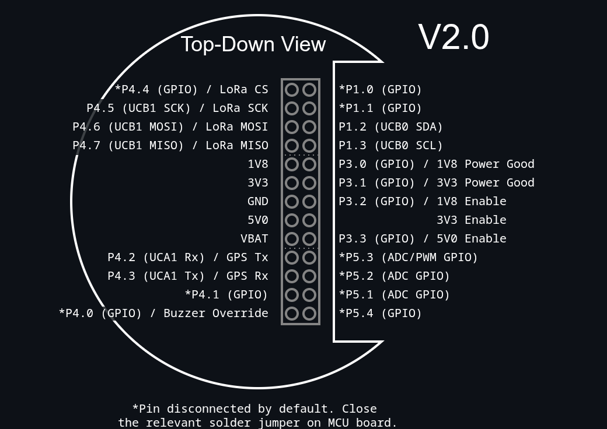
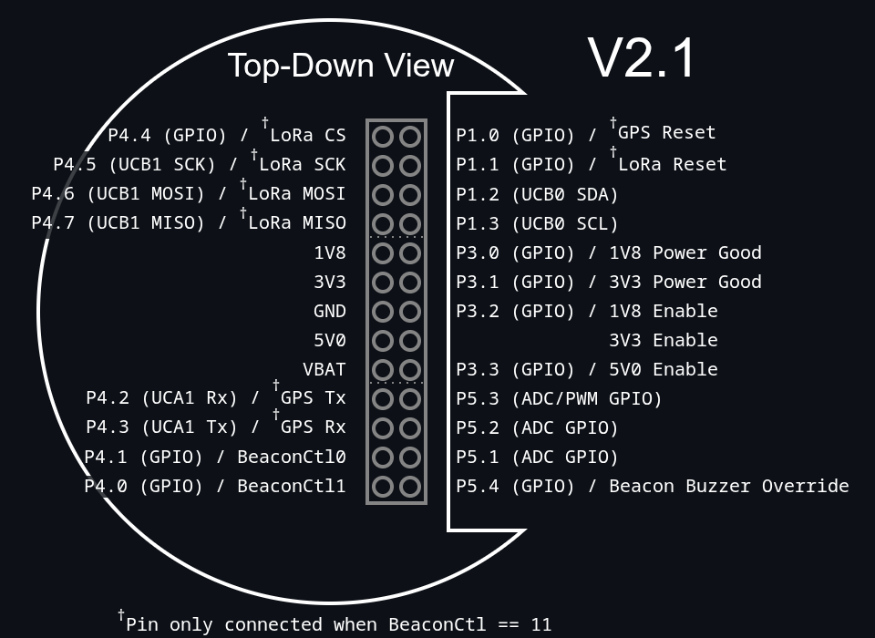

# Beacon board

# v2.0.x
The v2.0 beacon board offers a [PA1616D](https://drive.google.com/file/d/1kfhYX9w9B1p3TzluX87McfV2YKG-f-gQ/view) GPS module, an [RFM95](https://cdn.sparkfun.com/assets/learn_tutorials/8/0/4/RFM95_96_97_98W.pdf) LoRa radio (uses the sx1276 chipset), and an [audio buzzer](https://www.digikey.co.nz/en/products/detail/same-sky-formerly-cui-devices/CMT-8504-100-SMT-TR/10326202) capable of 100dB at 10cm, which should be audible from up to 50-100m away.
The buzzer automatically beeps every few seconds, but this can be silenced by outputting a logic low onto the 'Beacon buzzer override' pin. 

Beacon outputs: MISO, GPS Tx

MCU outputs: MOSI, SCK, LoRa CS, GPS Rx

# v2.1.x
The v2.1 beacon offers the same peripherals as the v2.0 board, but with an onboard controller that offers additional functional modes. The beacon board can now operate in an autonomous manner, forwarding GPS packets to the radio, buzzing the buzzer, or both. In 'manual' mode the peripherals are instead exposed to the stack and operates identically to v2.0. The beacon mode is controlled by two stack pins BCtrl0 and BCtrl1. The beacon board defaults to 'Auto - Active' mode by internally connecting a pullup resistor to BCtrl1 and a pulldown resistor to BCtrl0.

| BCtrl1 | BCtrl0 | State |
| ------ | ------ | -------- |
| 0      | 0      | 'Auto - Sleep' mode, sleep mode. |
| 0      | 1      | 'Auto - Beep' mode, buzzer only.|
| 1      | 0      | 'Auto - Active' mode, buzzer active, GPS location sent over LoRa radio.* |
| 1      | 1      | 'Manual' mode, all peripheral pins connected to stack. |

*Note that the buzzer override pin is still exposed, which allows for a GPS-only mode by configuring BCtrl to 'Auto Active' and outputting a logic low on the buzzer override pin.

Beacon outputs: MISO, GPS Tx

MCU outputs: MOSI, SCK, LoRa CS, GPS Rx, GPS Reset, LoRa Reset
