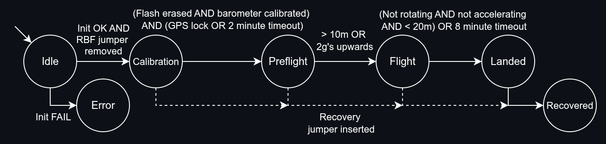

# MCU Reference Firmware
Reference MCU firmware for PSat.

# Overview
This firmware is primarily focused on data-gathering. At a configurable interval it reads from the barometer and IMU, battery, and GPS. During flight this data is stored in the onboard flash memory, to be extracted after payload recovery. It also transmits it's current location during flight (and after landing), and beeps the onboard audio buzzer when landed.
All of this behaviour is moderated by a state machine:

Upon reset, some initialisation occurs for various sensors, then the previous state is read from non-volatile memory onboard the MSP430. On each state transition the new mode is written to the non-volatile memory, so **if the MSP430 resets the program will resume from the state it was in before the reset**. The current mode is indicated by the colour of the status LED on the MCU board.

**Idle** (Blue): The system is inert. The Beacon board is set to AutoSleep mode. The payload checks if the RBF jumper has been removed. Once armed, the program moves to Calibration. **At any point from here onwards, should the recovery jumper be inserted then the payload will move immediately to Recovered.**

**Calibration** (Yellow): The Beacon board is set to Manual mode. The flash memory is erased (can take a while), and the barometer is queried for pressure, and this pressure is converted to altitude, which is set as '0 m'. The GPS is polled for up to two minutes to wait for a GPS lock. The program unconditionally moves to Preflight after this two minutes is up.

**Preflight** (Green): The onboard barometer and IMU are polled to check for either a 10 m height, or an upwards acceleration of 2g's. On either condition, the program moves to Flight.

**Flight** (Magenta): All sensors are polled at their configured frequency and the results are stored in the onboard flash memory, if successful. The program checks to see if the payload is not rotating, not accelerating, and less than 20 m. If this condition is fulfilled, or if it has been 8 minutes since the transition to Flight, the program moves to Landed.

**Landed** (Cyan): The audio buzzer is enabled and the Beacon board is reverted to AutoActive mode. The payload checks to see if the recovery jumper has been inserted. If so, it moves to Recovered.

**Recovered** (Off): The audio buzzer is disabled, and the Beacon board is set to AutoSleep mode. From this point the payload is completely inert. **Because the system remembers the previous state on reset, the only way to leave Recovered is to erase the non-volatile memory on the MSP430, e.g. by reprogramming the board [see below].** This ensures that the data stored in the flash memory isn't overwritten accidentally.

**Error** (Red): Any unexpected (or unrecoverable) errors cause the system to 'panic', which is effectively it's own state. Unlike the other states, the Error state isn't written to non-volatile memory, so any resets will return the program to the state prior to entering the Error state. 

The main way to enter Error is by the board failing initialisation, usually down to the beacon board not being attached, or peripherals failing to communicate due to poor soldering, or poor connectivity through non-soldered contacts like the stack headers. 
*The Error state is currently entered if the beacon board isn't detected during initialisation. As the non-soldered contacts connecting the MCU board and beacon board are less reliable, I suspect this could be an issue and a possible cause of mission failure. A better solution would be to adapt the code to make the beacon board initialisation fallible (e.g. return `Option<Radio>` and `Option<Gps>`), and make any operations involving the beacon board no-ops in the `None` case.*

## Remove-Before-Flight (RBF) and Recovery pins
The MCU board uses two pins to control arming and disarming. A single two-pin jumper allows either the RBF pin (P2.3) or the Recovery pin (P2.7) to be connected to a common middle terminal. When the jumper and connects the RBF pin to the common, the payload is held in the Idle state, inert. When the Recovery pin is connected to the common pin the payload is disarmed and moved to the Recovery state (preventing any possible future activations). When the jumper is removed entirely the payload is considered armed.

The RBF pin and Recovery pin are inputs with pulldowns enabled. The common terminal (P3.6) is an output set high.

The intended usage is that the jumper should be placed on the RBF pin until shortly before launch. The jumper should then be removed, which arms the payload and begins calibration. Reattaching the RBF jumper after calibration has begun has no effect - in the event of a false arming, the payload should be reprogrammed using the steps presented below in the 'Programming > Operation > Features' section. After landing, the jumper can be placed on the Recovery pin to silence the buzzer and generally disarm the payload, ensuring any stored data is retained.

# Programming
The instructions below assume a Linux device, though most of it can also be done on a windows device, with one possible exception.

## Dependencies
Install [Rust](https://www.rust-lang.org/learn/get-started)

Install [MSP430-GCC](https://www.ti.com/tool/MSP430-GCC-OPENSOURCE) (installer or toolchain-only, but make sure it's on your PATH).

Install [mspdebug](https://gnutoolchains.com/mspdebug/). Make sure it's on your PATH.

Then run the following commands:
`rustup install toolchain nightly`
`rustup component add rust-src --toolchain nightly`

On Linux you will have to change the 'runner' line in `.cargo/config.toml` from `run.bat` to `run.sh`.

You can now build the executable with `cargo build --release`. In addition `cargo run --release` will build and attempt to flash the program to a connected MSP430.

For reading the serial output from the payload, you will need `defmt-print` (see reasoning below). `defmt-print` can be installed with `cargo install defmt-print`. Make sure that the cargo executables folder (e.g. `~/.cargo/bin`) is on your PATH.

## Operation

Because this program is quite large for the MSP430, it uses [deferred formatting](https://defmt.ferrous-systems.com/). What this means is that strings are not stored on the MCU and sent directly over UART, but instead a compressed code is stored and sent and the receiving computer is expected to decode it. This requires that the executable be present on the receiving machine - either by copying the flashed executable (see filepath below), or just compiling the program on the receiving computer. Once the executable is present, the serial output can be decoded by passing the output through `defmt-print`, e.g.:

`stty -F /dev/ttyUSB0 115200 raw; cat /dev/ttyUSB0 | defmt-print -w -e ./target/msp430-none-elf/release/apss_mcu_pcb_firmware`

I don't have a good solution for reading serial ouput and piping it through to `defmt-print` on Windows, but I presume it could be done with WSL somehow.

### Logging

The level of logging can be controlled through the `DEFMT_LOG` environment variable when the program is built, e.g. `DEFMT_LOG=trace cargo build --release`.
The logging levels are: `trace`, `debug`, `info`, `warn`, and `error`. The `trace` and `debug` levels outline the control flow of the program and sensor outputs for each iteration respectively, and can quickly become overwhelming. The `info` level will give information about state transitions within the program. `warn` describes any timeouts, and `error` is typically reserved for fatal errors, such as misbehaving peripherals, a lack of a connected Beacon board, etc.

### Features

Building with the `fresh_start` feature clears the non-volatile memory on reset, making each reset 'start fresh':
`cargo run --release --features fresh_start`. This is purely for testing/debugging purposes, and should *not* be enabled for flight.

To return a payload in the Recovered state back to the Idle state, the board should be programmed once with the `fresh_start` feature enabled (and the RBF jumper inserted), *then programmed again* with the `fresh_start` feature *disabled* (as we want the MSP430 to remember previous states during launch).

To retrieve the stored data from the onboard flash memory, reprogram the board with the `recovery` feature enabled: `cargo run --release --features recovery`. The MSP430 will read the data out from the flash memory and echo it out over the SPI bus, using P6.0 as the chip select. Each transaction consists of an address and some number of data bytes. The first four bytes of each transaction are the address (in little endian order) of the first data byte. When the MSP430 has read out all of the flash memory, it pauses briefly before beginning the readout again. The green LED blinks during the readout process.
